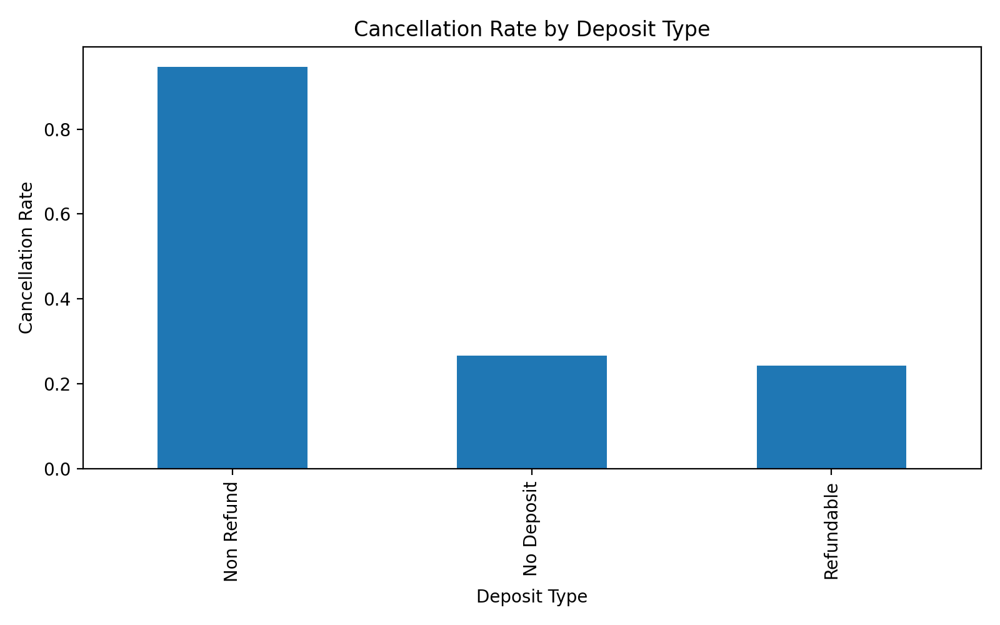
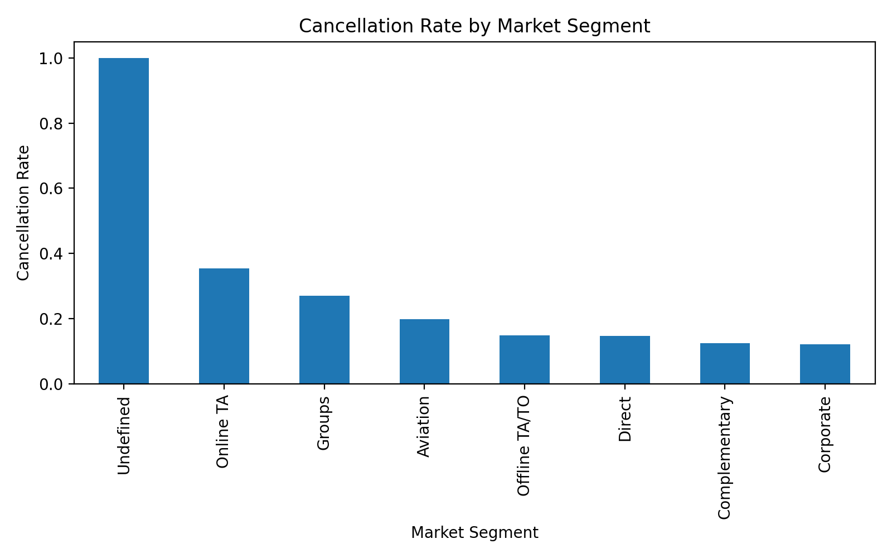
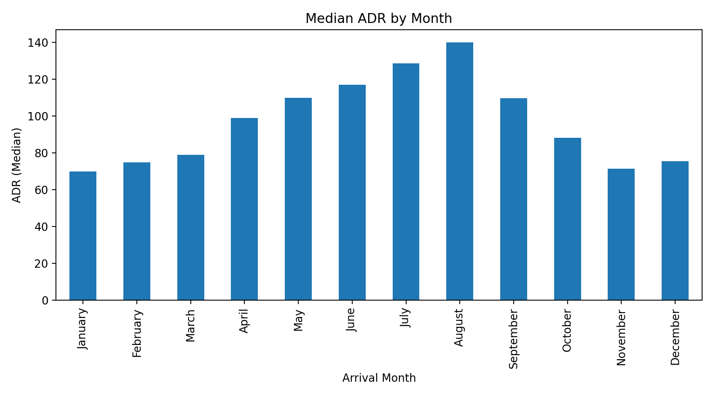

# Google Data Analytics Capstone: Hotel Bookings Analysis  

This project is part of my **Google Data Analytics Professional Certificate** portfolio.  
It demonstrates the full data analysis process — from **Ask, Prepare, Process, Analyze, Share, Act** — on the popular **Hotel Bookings dataset**.  

## 📊 Project Steps
1. **Ask**: Identify factors correlated with booking cancellations.  
2. **Prepare**: Load and clean 119,390 rows of hotel booking data.  
3. **Process**: Feature engineering (lead time, customer type, ADR, etc.).  
4. **Analyze**: Descriptive statistics and trend analysis with Python.  
5. **Share**: Visualizations (see below).  
6. **Act**: Recommendations to reduce cancellations and optimize revenue.  

## 🛠 Tools Used
- Python (Pandas, Matplotlib, NumPy)  
- Google Colab  
- GitHub for version control  

## 📊 Visualizations  

### Cancellation Rate by Deposit Type  
  

### Cancellation Rate by Market Segment  
  

### Median ADR by Month  
  

---

## ✅ Key Insights  

- Non-refundable deposits strongly increase cancellation rates.  
- Online TA and Group bookings have higher cancellation rates.  
- ADR (price) peaks during the summer months (July–August).  

---

**Author:** Yahya Mubaraki  

